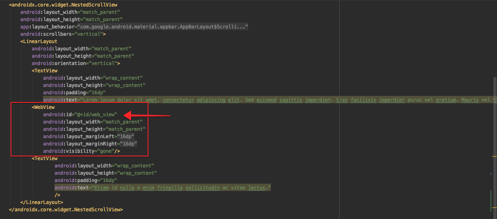
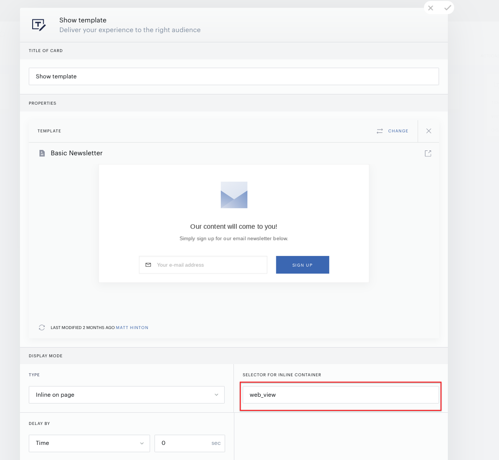
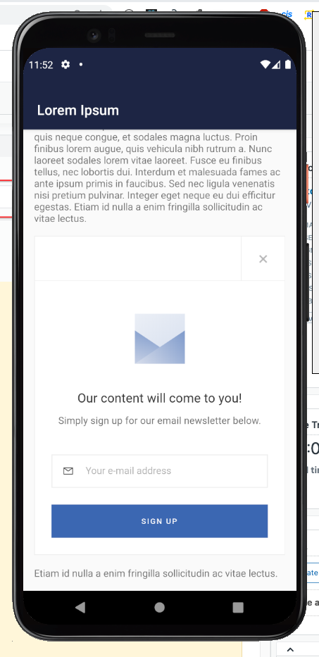

# Piano Composer Show Template for Android

## Getting started
This is helper for simplifying "Show Template" event processing

### Dependencies

The Piano Composer Show Template is available as an AAR via Maven Central. To add dependencies, open your project’s build.gradle/build.gradle.kts and update the dependencies block as follows:

Groovy
```groovy
dependencies {
    // ... other project dependencies
    implementation 'io.piano.android:composer-show-template:$VERSION'
}
```

Kotlin DSL
```kotlin
dependencies {
    implementation("io.piano.android:composer-show-template:$VERSION")
}
```

### Usage
Add code into your show template listener

Java
```java
// Use one of these
ShowTemplateController.show(activity, showTemplateEvent, customJavascriptInterface);
ShowTemplateController.show(activity, showTemplateEvent, customJavascriptInterface, inlineWebViewProvider);
```

Kotlin
```kotlin
// Use one of these
ShowTemplateController.show(activity, showTemplateEvent, customJavascriptInterface)
ShowTemplateController.show(activity, showTemplateEvent, customJavascriptInterface, inlineWebViewProvider)
```

## How to show templates inline

First, you need to prepare some content with a webview placed inline:



Then, you can target this webview in Composer by adding the ID of the webview into the inline container selector field:



This will result in the template to be shown inline in your Android app. For example like this:



